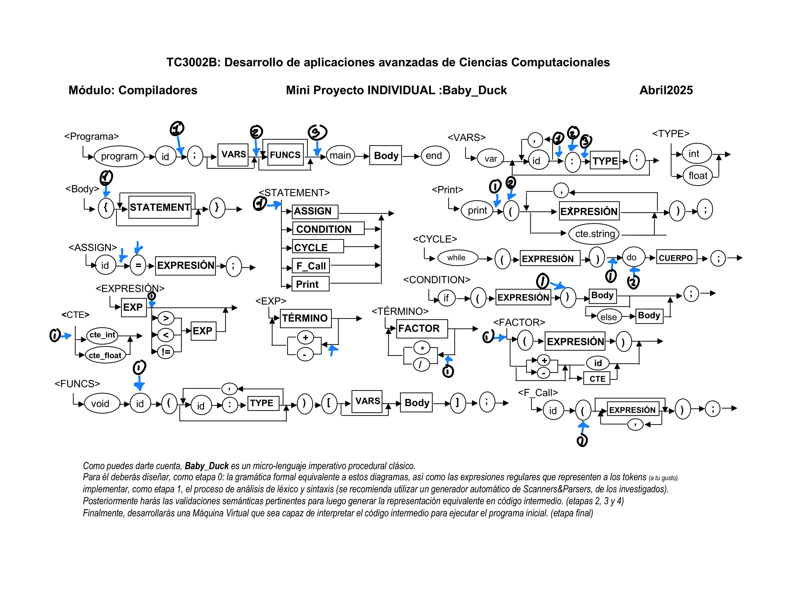

# Documentación Completa del Compilador BabyDuck

**Curso:** TC3002B.503
**Estudiante:** Marco Ottavio Podesta Vezzali - A00833604
**Fecha:** Junio 2025

## Tabla de Contenidos
1. [Visión General](#visión-general)
2. [Herramientas y Tecnologías](#herramientas-y-tecnologías)
3. [Arquitectura del Compilador](#arquitectura-del-compilador)
4. [Análisis Léxico y Sintáctico](#análisis-léxico-y-sintáctico)
5. [Análisis Semántico](#análisis-semántico)
6. [Gestión de Memoria](#gestión-de-memoria)
7. [Generación de Código Intermedio](#generación-de-código-intermedio)
8. [Máquina Virtual e Intérprete](#máquina-virtual-e-intérprete)
9. [Casos de Prueba y Validación](#casos-de-prueba-y-validación)
10. [Limitaciones y Extensiones Futuras](#limitaciones-y-extensiones-futuras)

---

## Visión General

### Propósito del Compilador
El compilador BabyDuck es un compilador educativo completo que implementa todas las fases de compilación para un lenguaje de programación simplificado. El proyecto demuestra los principios fundamentales de construcción de compiladores, desde el análisis léxico hasta la ejecución de código.

### Características del Lenguaje BabyDuck
- **Variables**: Tipos `int` y `float` con declaración explícita
- **Funciones**: Definición de funciones `void` con parámetros
- **Estructuras de Control**:
  - Condicionales `if-else`
  - Ciclos `while-do`
- **Operaciones**:
  - Aritméticas: `+`, `-`, `*`, `/`
  - Relacionales: `<`, `>`, `==`, `!=`
  - Asignación: `=`
- **Entrada/Salida**: Instrucción `print` para mostrar valores y cadenas
- **Ámbitos**: Variables globales y locales por función

### Flujo de Compilación
```
Código Fuente (.bd) → Análisis Léxico → Análisis Sintáctico →
Análisis Semántico → Generación de Cuádruplos → Interpretación/Ejecución
```

### Ejemplo de Programa BabyDuck
```babyduck
program ejemplo;
var x, y: int;

void calcular(n: int) {
    var resultado: int;
    resultado = n * 2;
    print("El doble de", n, "es", resultado);
};

main {
    x = 5;
    y = 10;
    print("Valores iniciales: x =", x, ", y =", y);
    calcular(x);
    calcular(y);
} end
```

## Herramientas y Tecnologías

### Lark Parser
**Lark** es una biblioteca de Python para análisis léxico y sintáctico que se eligió por las siguientes razones:

#### Ventajas de Lark
- **Nativo en Python**: No requiere herramientas externas como ANTLR (que necesita JDK)
- **Sintaxis EBNF**: Gramática declarativa fácil de leer y mantener
- **Múltiples algoritmos**: Soporta LALR(1) y Earley para diferentes tipos de gramáticas
- **Transformer integrado**: Facilita el análisis semántico mediante el patrón Transformer
- **Generación automática de AST**: Reduce el código boilerplate

#### Comparación con ANTLR
| Aspecto | Lark | ANTLR |
|---------|------|-------|
| **Instalación** | `pip install lark` | Requiere JDK + herramientas Java |
| **Integración** | Nativo Python | Generación de código externa |
| **Curva de aprendizaje** | Menor | Mayor |
| **Flexibilidad** | Buena para proyectos medianos | Excelente para proyectos grandes |
| **Rendimiento** | Adecuado | Superior |

#### Configuración Utilizada
```python
parser = Lark(
    grammar,
    parser="lalr",      # Algoritmo LALR(1) para eficiencia
    start="programa",   # Símbolo inicial de la gramática
)
```

### Tecnologías Complementarias
- **Python 3.7+**: Lenguaje de implementación principal
- **Dataclasses**: Para estructuras de datos inmutables y legibles
- **Type Hints**: Para mejor documentación y detección de errores
- **Programación Orientada a Objetos**: Organización modular del código

---

## Arquitectura del Compilador

### Estructura del Proyecto
```
entregable5/
├── main.py                    # Punto de entrada principal
├── babyduck.py               # Cargador de gramática y parser
├── BabyDuck.lark            # Definición formal de la gramática
├── semantic/
│   ├── analyzer.py          # Analizador semántico (Transformer)
│   ├── variable_table.py    # Tabla de variables por ámbito
│   ├── function_directory.py # Directorio global de funciones
│   ├── memory_manager.py    # Gestor de direcciones virtuales
│   ├── semantic_cube.py     # Cubo semántico para validación de tipos
│   └── interpreter.py       # Máquina virtual e intérprete
└── test/                    # Programas de prueba en BabyDuck
    ├── program.bd
    ├── fibonacci.bd
    ├── fibonacci_fun.bd
    └── ...
```

### Componentes Principales

#### 1. Parser y Gramática (babyduck.py, BabyDuck.lark)
- **Responsabilidad**: Análisis léxico y sintáctico
- **Tecnología**: Lark Parser con algoritmo LALR(1)
- **Salida**: Árbol de Sintaxis Abstracta (AST)

#### 2. Analizador Semántico (semantic/analyzer.py)
- **Responsabilidad**: Validación semántica y generación de código intermedio
- **Patrón**: Transformer de Lark para recorrido bottom-up del AST
- **Funciones principales**:
  - Verificación de declaraciones y uso de variables
  - Validación de tipos mediante cubo semántico
  - Generación de cuádruplos (código intermedio)
  - Gestión de ámbitos y tablas de símbolos

#### 3. Gestores de Memoria y Símbolos
- **MemoryManager**: Asignación de direcciones virtuales por ámbito y tipo
- **VariableTable**: Tabla de variables para cada ámbito (global/local)
- **FunctionDirectory**: Directorio global de funciones con sus metadatos

#### 4. Intérprete y Máquina Virtual (semantic/interpreter.py)
- **Responsabilidad**: Ejecución de cuádruplos generados
- **Funciones**:
  - Gestión de memoria en tiempo de ejecución
  - Manejo de pila de llamadas para funciones
  - Ejecución de operaciones aritméticas y lógicas
  - Control de flujo (saltos condicionales e incondicionales)

### Patrones de Diseño Implementados

#### Transformer Pattern
- **Uso**: Análisis semántico mediante herencia de `lark.Transformer`
- **Ventaja**: Recorrido automático del AST con métodos específicos por nodo

#### Factory Pattern
- **Uso**: Asignación de direcciones de memoria según ámbito y tipo
- **Implementación**: `MemoryManager.allocate(scope, var_type)`

#### Strategy Pattern
- **Uso**: Validación de operaciones mediante cubo semántico
- **Implementación**: `semantic_cube[tipo_izq][tipo_der][operador]`

---

## Análisis Léxico y Sintáctico

### Definición de Tokens

El analizador léxico de BabyDuck reconoce los siguientes tokens definidos en `BabyDuck.lark`:

#### Palabras Reservadas
```lark
PROGRAM:  "program"    VAR:      "var"       MAIN:     "main"
VOID:     "void"       INT:      "int"       FLOAT:    "float"
WHILE:    "while"      DO:       "do"        END:      "end"
IF:       "if"         ELSE:     "else"      PRINT:    "print"
```

#### Identificadores y Constantes
```lark
PROG_ID:    /[a-zA-Z_][a-zA-Z0-9_]*/    # Nombre del programa
ID:         /[a-zA-Z_][a-zA-Z0-9_]*/    # Variables y funciones
CTE_INT:    /\d+/                       # Constantes enteras
CTE_FLOAT:  /\d+\.\d+/                  # Constantes flotantes
CTE_STRING: ESCAPED_STRING              # Cadenas con escape
```

#### Operadores y Delimitadores
```lark
# Operadores aritméticos
PLUS: "+"    MINUS: "-"    MULT: "*"    DIV: "/"

# Operadores relacionales
LT: "<"      GT: ">"       EQ: "=="     NEQ: "!="

# Asignación
ASSIGN: "="

# Delimitadores
SEMICOLON: ";"    COMMA: ","      COLON: ":"
LPAREN: "("       RPAREN: ")"     LBRACE: "{"    RBRACE: "}"
```

### Gramática Libre de Contexto

#### Estructura Principal del Programa
```lark
programa: PROGRAM PROG_ID SEMICOLON vars funcs MAIN body END

vars: VAR ID (COMMA ID)* COLON tipo SEMICOLON vars
    | -> empty

tipo: INT | FLOAT

funcs: func*

func: VOID ID LPAREN param_list RPAREN vars body SEMICOLON

param_list: (ID COLON tipo (COMMA ID COLON tipo)*)?
```

#### Cuerpo y Declaraciones
```lark
body: LBRACE statement* RBRACE

statement: assign | print_stmt | f_call | condition | cycle

assign: ID ASSIGN expr SEMICOLON

print_stmt: PRINT LPAREN print_list RPAREN SEMICOLON
print_list: (expr | CTE_STRING) (COMMA (expr | CTE_STRING))*

f_call: ID LPAREN (expr (COMMA expr)*)? RPAREN SEMICOLON

condition: IF LPAREN expr RPAREN body (ELSE body)? SEMICOLON

cycle: WHILE LPAREN expr RPAREN DO body SEMICOLON
```

#### Expresiones con Precedencia
La precedencia de operadores se maneja mediante una jerarquía de reglas:

```lark
# Nivel 1: Operadores relacionales (menor precedencia)
?expr: expr GT expr   -> gt
     | expr LT expr   -> lt
     | expr EQ expr   -> eq
     | expr NEQ expr  -> neq
     | sum

# Nivel 2: Suma y resta
?sum: sum PLUS term   -> add
    | sum MINUS term  -> sub
    | term

# Nivel 3: Multiplicación y división
?term: term MULT factor -> mul
     | term DIV factor  -> div
     | factor

# Nivel 4: Factores (mayor precedencia)
?factor: LPAREN expr RPAREN -> group
       | PLUS factor        -> pos
       | MINUS factor       -> neg
       | ID                 -> var
       | CTE_FLOAT          -> float
       | CTE_INT            -> int
```

### Puntos Neurálgicos del Lenguaje BabyDuck




#### Programa
- **Después de `ID;`**: Punto neurálgico para registrar el nombre del programa y crear el ámbito global.
- **Después de `var`**: Para procesar todas las variables globales y asignarles direcciones de memoria.
- **Después de `funcs`**: Para completar el directorio de funciones antes de comenzar con el bloque principal.

#### Vars
- **Después de `ID`, antes de dos puntos**: Para acumular los identificadores de variables que comparten tipo.
- **Dos puntos**: Marca la transición entre los nombres de variables y su tipo.
- **Después de dos puntos**: Para asignar el tipo a todas las variables acumuladas y registrarlas en la tabla correspondiente.

#### Body
- **Left bracket**: Punto neurálgico para crear un nuevo ámbito local y preparar la tabla de variables para ese bloque.

#### Statements
- **Antes de cualquier opción**: Para inicializar estructuras necesarias antes de procesar cualquier instrucción.

#### Print
- **Después de `print`**: Para preparar la generación de cuádruplos de impresión.
- **Left parenthesis**: Para iniciar la lista de expresiones a imprimir.

#### Expresión
- **Después de `exp`**: Para generar cuádruplos de operaciones relacionales cuando se completa una expresión.

#### Cycle
- **Después de `right parenthesis`, antes de `do`**: Para generar el cuádruplo de evaluación condicional del ciclo.
- **`do`**: Para marcar el inicio del cuerpo del ciclo y guardar la posición para el salto de retorno.

#### Condition
- **`Right parenthesis`**: Para generar el cuádruplo `GOTOF` que evalúa la condición y salta si es falsa.

#### Exp
- **Antes del símbolo negativo o positivo**: Para manejar la precedencia de operadores aritméticos de suma/resta.

#### Término
- **Antes de `mult` o `division`**: Para manejar la precedencia de operadores de multiplicación/división.

#### Cte
- **Antes de cualquier `cte`**: Para preparar el procesamiento de constantes y asignarles direcciones de memoria.

#### Factor
- **Antes de cualquier cosa**: Punto neurálgico para manejar la precedencia más alta (paréntesis, valores atómicos).

#### Funcs
- **`ID`**: Para registrar el nombre de la función en el directorio de funciones y crear su ámbito local.

#### F_call
- **`Left parenthesis`**: Para verificar que la función existe y generar el cuádruplo `ERA` que prepara el espacio para la llamada.

## Análisis Semántico

### Arquitectura del Analizador Semántico

El analizador semántico (`semantic/analyzer.py`) hereda de `lark.Transformer` e implementa un análisis de dos pasadas para manejar correctamente las declaraciones de funciones y variables.

#### Clase SemanticAnalyzer
```python
class SemanticAnalyzer(Transformer):
    def __init__(self):
        super().__init__()
        # Estructuras de datos principales
        self.global_vars = VariableTable()
        self.func_dir = FunctionDirectory()
        self.memory = MemoryManager()

        # Pilas para generación de cuádruplos
        self.operands = []      # Direcciones de operandos
        self.types = []         # Tipos de operandos
        self.operators = []     # Operadores pendientes

        # Código intermedio
        self.quadruples = []    # Lista de cuádruplos
        self.next_quad = 0      # Contador de cuádruplos

        # Control de contexto
        self.current_function = None
```

### Análisis de Dos Pasadas

#### Primera Pasada: Recolección de Firmas
Antes del análisis principal, se recolectan todas las firmas de funciones para permitir llamadas hacia adelante:

```python
def _collect_function_signatures(self, node):
    """Recolecta firmas de funciones antes del análisis principal"""
    if hasattr(node, 'data') and node.data == 'func':
        # Extrae nombre de función
        fname = node.children[1].value

        # Extrae parámetros y tipos
        param_list = node.children[2]
        rawp = self._extract_params(param_list)

        # Registra función en directorio
        if not self.func_dir.has_function(fname):
            self.func_dir.add_function(
                name=fname,
                return_type='void',
                param_types=[t for (_, t) in rawp],
                start_quad=0  # Se actualizará en segunda pasada
            )
```

#### Segunda Pasada: Análisis Completo
Durante la transformación del AST, se realiza:
- Verificación de tipos mediante cubo semántico
- Generación de cuádruplos
- Gestión de ámbitos y tablas de símbolos
- Validación de declaraciones y uso de variables

### Estructuras de Datos Principales

#### 1. Tabla de Variables (VariableTable)
```python
@dataclass
class VariableEntry:
    var_type: str    # 'int' o 'float'
    address: int     # Dirección virtual asignada

class VariableTable:
    def __init__(self):
        self._table: Dict[str, VariableEntry] = {}

    def add_variable(self, name: str, var_type: str, address: int):
        if name in self._table:
            raise KeyError(f"Variable '{name}' ya declarada")
        self._table[name] = VariableEntry(var_type, address)
```

#### 2. Directorio de Funciones (FunctionDirectory)
```python
@dataclass
class FunctionEntry:
    return_type: str           # 'void'
    param_types: List[str]     # Tipos de parámetros
    variables: VariableTable   # Variables locales
    start_quad: int           # Cuádruplo de inicio

class FunctionDirectory:
    def __init__(self):
        self._functions: Dict[str, FunctionEntry] = {}
```

#### 3. Cubo Semántico
Matriz tridimensional para validación de operaciones:
```python
semantic_cube = {
    'int': {
        'int': {
            '+': 'int', '-': 'int', '*': 'int', '/': 'int',
            '<': 'bool', '>': 'bool', '==': 'bool', '!=': 'bool',
            '=': 'int'
        },
        'float': {
            '+': 'float', '-': 'float', '*': 'float', '/': 'float',
            '<': 'bool', '>': 'bool', '==': 'bool', '!=': 'bool',
            '=': 'error'  # No se puede asignar float a int
        }
    },
    'float': {
        'int': {
            '+': 'float', '-': 'float', '*': 'float', '/': 'float',
            '<': 'bool', '>': 'bool', '==': 'bool', '!=': 'bool',
            '=': 'float'  # Promoción de int a float
        },
        'float': {
            '+': 'float', '-': 'float', '*': 'float', '/': 'float',
            '<': 'bool', '>': 'bool', '==': 'bool', '!=': 'bool',
            '=': 'float'
        }
    }
}
```

### Generación de Cuádruplos

#### Pilas para Expresiones
El compilador utiliza tres pilas para manejar expresiones:

1. **Pila de Operandos**: Direcciones de variables, constantes y temporales
2. **Pila de Tipos**: Tipos correspondientes a cada operando
3. **Pila de Operadores**: Operadores pendientes de procesar

#### Proceso de Generación
```python
def _generate_quad(self, operator: str):
    """Genera un cuádruplo para una operación"""
    # Pop de operandos y tipos
    r_addr = self.operands.pop()
    l_addr = self.operands.pop()
    r_type = self.types.pop()
    l_type = self.types.pop()

    # Validación mediante cubo semántico
    res_type = semantic_cube[l_type][r_type][operator]
    if res_type == 'error':
        raise SemanticError(f"Tipo inválido para {l_type} {operator} {r_type}")

    # Asignación de temporal para resultado
    temp = self.memory.allocate_temp(res_type)

    # Generación del cuádruplo
    self.quadruples.append((operator, l_addr, r_addr, temp))
    self.next_quad += 1

    # Push del resultado
    self.operands.append(temp)
    self.types.append(res_type)
```
---

## Gestión de Memoria

### Arquitectura de Memoria Virtual

El `MemoryManager` implementa un sistema de direcciones virtuales organizadas por ámbito y tipo, garantizando que no haya solapamientos entre diferentes categorías de datos.

#### Rangos de Memoria
```python
class MemoryManager:
    def __init__(self):
        self.ranges = {
            'global': {
                'int': (1000, 1999),    # Variables globales enteras
                'float': (2000, 2999),  # Variables globales flotantes
                'bool': (3000, 3999)    # Resultados booleanos globales
            },
            'local': {
                'int': (4000, 4999),    # Variables locales enteras
                'float': (5000, 5999),  # Variables locales flotantes
                'bool': (6000, 6999)    # Resultados booleanos locales
            },
            'temp': {
                'int': (7000, 7999),    # Temporales enteros
                'float': (8000, 8999),  # Temporales flotantes
                'bool': (9000, 9999)    # Temporales booleanos
            },
            'const': {
                'int': (10000, 10999),  # Constantes enteras
                'float': (11000, 11999), # Constantes flotantes
                'bool': (12000, 12999)  # Constantes booleanas
            }
        }
```

#### Asignación de Direcciones
```python
def allocate(self, scope: str, var_type: str) -> int:
    """Asigna una dirección virtual para una variable"""
    if scope not in self._counters:
        self._counters[scope] = {
            'int': self.ranges[scope]['int'][0],
            'float': self.ranges[scope]['float'][0],
            'bool': self.ranges[scope]['bool'][0]
        }

    current = self._counters[scope][var_type]
    if current > self.ranges[scope][var_type][1]:
        raise MemoryError(f"Se agotó la memoria para {scope} {var_type}")

    self._counters[scope][var_type] += 1
    return current
```

#### Gestión de Constantes
Las constantes se manejan de forma especial para evitar duplicación:
```python
def allocate_constant(self, value: Union[int, float]) -> int:
    """Asigna dirección para constante, reutilizando si ya existe"""
    if value in self._const_table:
        return self._const_table[value]

    var_type = 'int' if isinstance(value, int) else 'float'
    addr = self.allocate('const', var_type)
    self._const_table[value] = addr
    return addr
```

### Ventajas del Sistema de Memoria Virtual

1. **Separación Clara**: Cada tipo de dato tiene su rango específico
2. **Detección de Errores**: Fácil identificación del tipo de variable por su dirección
3. **Escalabilidad**: Rangos amplios permiten programas grandes
4. **Eficiencia**: Acceso directo sin búsquedas en tablas hash
5. **Debugging**: Direcciones legibles para depuración

---

## Generación de Código Intermedio

### Arquitectura de Cuádruplos

Los cuádruplos son la representación intermedia del código, con la estructura:
```
(operador, operando_izquierdo, operando_derecho, resultado)
```

#### Tipos de Cuádruplos Generados

##### 1. Operaciones Aritméticas
```python
# Ejemplo: x = a + b
('+', 1000, 1001, 7000)  # temp7000 = var1000 + var1001
('=', 7000, None, 1002)  # var1002 = temp7000
```

##### 2. Operaciones Relacionales
```python
# Ejemplo: if (x > 5)
('>', 1000, 10000, 9000)  # temp9000 = var1000 > const10000
('GOTOF', 9000, None, 15) # if !temp9000 goto quad_15
```

##### 3. Control de Flujo
```python
# Saltos condicionales e incondicionales
('GOTOF', direccion_condicion, None, etiqueta_falso)
('GOTO', None, None, etiqueta_destino)
```

##### 4. Llamadas a Funciones
```python
# Secuencia para llamada: foo(x, y)
('ERA', None, None, 'foo')        # Preparar espacio
('PARAM', 1000, None, 1)          # Parámetro 1
('PARAM', 1001, None, 2)          # Parámetro 2
('GOSUB', None, None, 'foo')      # Llamar función
```

##### 5. Instrucciones de E/S
```python
# print("Hola", x)
('print', 12000, None, None)      # Imprimir constante string
('print', 1000, None, None)       # Imprimir variable
```

### Proceso de Generación

#### Manejo de Expresiones
Las expresiones se procesan usando tres pilas que mantienen sincronía:

```python
# Ejemplo: resultado = (a + b) * c
# 1. Procesar 'a'
operands.push(addr_a)
types.push('int')

# 2. Procesar '+'
operators.push('+')

# 3. Procesar 'b'
operands.push(addr_b)
types.push('int')

# 4. Generar cuádruplo para '+'
_generate_quad('+')  # Produce: ('+', addr_a, addr_b, temp1)

# 5. Continuar con '*' y 'c'...
```

#### Manejo de Estructuras de Control

##### Condicionales (if-else)
```python
def condition(self, items):
    # items = [expr, body, else_body_opt]
    expr_addr = items[0]

    # Generar salto condicional
    gotof_quad = self.next_quad
    self.quadruples.append(('GOTOF', expr_addr, None, None))
    self.next_quad += 1

    # Procesar cuerpo del if
    items[1]  # body

    if len(items) > 2:  # Hay else
        # Salto incondicional al final
        goto_quad = self.next_quad
        self.quadruples.append(('GOTO', None, None, None))
        self.next_quad += 1

        # Actualizar GOTOF para apuntar al else
        self.quadruples[gotof_quad] = ('GOTOF', expr_addr, None, self.next_quad)

        # Procesar else
        items[2]  # else_body

        # Actualizar GOTO para saltar después del else
        self.quadruples[goto_quad] = ('GOTO', None, None, self.next_quad)
    else:
        # Solo if, actualizar GOTOF para saltar al final
        self.quadruples[gotof_quad] = ('GOTOF', expr_addr, None, self.next_quad)
```

##### Ciclos (while)
```python
def cycle(self, items):
    # items = [expr, body]
    loop_start = self.next_quad

    expr_addr = items[0]

    # Salto condicional para salir del ciclo
    gotof_quad = self.next_quad
    self.quadruples.append(('GOTOF', expr_addr, None, None))
    self.next_quad += 1

    # Procesar cuerpo del ciclo
    items[1]  # body

    # Salto de regreso al inicio
    self.quadruples.append(('GOTO', None, None, loop_start))
    self.next_quad += 1

    # Actualizar GOTOF para salir del ciclo
    self.quadruples[gotof_quad] = ('GOTOF', expr_addr, None, self.next_quad)
```

---

## Máquina Virtual e Intérprete

### Arquitectura del Intérprete

El intérprete (`semantic/interpreter.py`) ejecuta los cuádruplos generados, implementando una máquina virtual que simula la ejecución del programa BabyDuck.

#### Clase Interpreter
```python
class Interpreter:
    def __init__(self, quadruples, global_vars, func_dir, memory):
        self.quadruples = quadruples
        self.global_vars = global_vars
        self.func_dir = func_dir
        self.memory = memory

        # Estado de ejecución
        self.instruction_pointer = 0
        self.call_stack = []
        self.memory_values = {}
        self.current_function_call = None
        self.param_values = {}
```

### Gestión de Memoria en Tiempo de Ejecución

#### Mapeo de Direcciones a Valores
```python
def _get_value(self, address):
    """Obtiene el valor almacenado en una dirección"""
    if address in self.memory_values:
        return self.memory_values[address]

    # Valores por defecto para direcciones no inicializadas
    if 1000 <= address <= 3999 or 4000 <= address <= 6999:  # Variables
        return 0
    elif 7000 <= address <= 9999:  # Temporales
        return 0
    elif 10000 <= address <= 12999:  # Constantes
        # Las constantes deben estar en la tabla del memory manager
        for value, addr in self.memory._const_table.items():
            if addr == address:
                return value
        return 0
    else:
        raise RuntimeError(f"Dirección inválida: {address}")

def _set_value(self, address, value):
    """Establece el valor en una dirección"""
    self.memory_values[address] = value
```

### Ejecución de Cuádruplos

#### Bucle Principal de Ejecución
```python
def execute(self):
    """Ejecuta los cuádruplos desde el programa principal"""
    # Encontrar inicio del programa principal (después de funciones)
    main_start = self._find_main_start()
    self.instruction_pointer = main_start

    while self.instruction_pointer < len(self.quadruples):
        quad = self.quadruples[self.instruction_pointer]
        op, left, right, result = quad

        # Ejecutar operación según el tipo
        if op in ['+', '-', '*', '/']:
            self._execute_arithmetic(left, right, result, op)
        elif op in ['<', '>', '==', '!=']:
            self._execute_comparison(left, right, result, op)
        elif op == '=':
            self._execute_assignment(left, result)
        elif op == 'print':
            self._execute_print(left)
        elif op == 'GOTOF':
            self._execute_gotof(left, result)
            continue  # No incrementar IP
        elif op == 'GOTO':
            self._execute_goto(result)
            continue  # No incrementar IP
        elif op == 'ERA':
            self._execute_era(result)
        elif op == 'PARAM':
            self._execute_param(left, result)
        elif op == 'GOSUB':
            self._execute_gosub(result)
            continue  # No incrementar IP
        elif op == 'ENDFUNC':
            self._execute_endfunc()
            continue  # No incrementar IP

        self.instruction_pointer += 1
```

#### Operaciones Aritméticas
```python
def _execute_arithmetic(self, left, right, result, operator):
    """Ejecuta operaciones aritméticas"""
    left_val = self._get_value(left)
    right_val = self._get_value(right)

    if operator == '+':
        res_val = left_val + right_val
    elif operator == '-':
        res_val = left_val - right_val
    elif operator == '*':
        res_val = left_val * right_val
    elif operator == '/':
        if right_val == 0:
            raise RuntimeError("División por cero")
        res_val = left_val / right_val

    self._set_value(result, res_val)
```

#### Operaciones de Comparación
```python
def _execute_comparison(self, left, right, result, operator):
    """Ejecuta operaciones de comparación"""
    left_val = self._get_value(left)
    right_val = self._get_value(right)

    if operator == '<':
        res_val = left_val < right_val
    elif operator == '>':
        res_val = left_val > right_val
    elif operator == '==':
        res_val = left_val == right_val
    elif operator == '!=':
        res_val = left_val != right_val

    self._set_value(result, 1 if res_val else 0)
```

### Gestión de Funciones

#### Llamadas a Funciones
```python
def _execute_era(self, func_name):
    """Prepara el espacio para una llamada a función"""
    self.current_function_call = func_name
    self.param_values = {}

def _execute_param(self, value_addr, param_num):
    """Establece el valor de un parámetro"""
    value = self._get_value(value_addr)
    self.param_values[param_num] = value

def _execute_gosub(self, func_name):
    """Ejecuta llamada a función"""
    # Guardar estado actual en la pila
    self.call_stack.append({
        'return_address': self.instruction_pointer + 1,
        'local_memory': {},
        'previous_function': self.current_function_call
    })

    # Configurar parámetros en memoria local
    func_entry = self.func_dir.get_function(func_name)
    param_addresses = []
    for var_name, var_entry in func_entry.variables.all_variables().items():
        param_addresses.append(var_entry.address)

    # Asignar valores de parámetros
    for i, addr in enumerate(param_addresses[:len(self.param_values)]):
        if (i + 1) in self.param_values:
            self._set_value(addr, self.param_values[i + 1])

    # Saltar al inicio de la función
    self.instruction_pointer = func_entry.start_quad

def _execute_endfunc(self):
    """Retorna de una función"""
    if not self.call_stack:
        raise RuntimeError("ENDFUNC sin llamada a función")

    # Restaurar estado anterior
    call_info = self.call_stack.pop()
    self.instruction_pointer = call_info['return_address']
    self.current_function_call = call_info['previous_function']
```

### Control de Flujo

#### Saltos Condicionales e Incondicionales
```python
def _execute_gotof(self, condition_addr, target_quad):
    """Salto condicional (si falso)"""
    condition_value = self._get_value(condition_addr)
    if not condition_value:  # Si es falso (0)
        self.instruction_pointer = target_quad
    else:
        self.instruction_pointer += 1

def _execute_goto(self, target_quad):
    """Salto incondicional"""
    self.instruction_pointer = target_quad
```

#### Instrucciones de E/S
```python
def _execute_print(self, value_addr):
    """Ejecuta instrucción print"""
    if isinstance(value_addr, str):
        # Es una cadena literal
        print(value_addr.strip('"'), end='')
    else:
        # Es una dirección de memoria
        value = self._get_value(value_addr)
        print(value, end='')
```

---

## Casos de Prueba y Validación

### Programas de Prueba Implementados

El compilador incluye una suite completa de programas de prueba que validan diferentes aspectos del lenguaje BabyDuck.

#### 1. Programa Básico (test/program.bd)
```babyduck
program ejemplo;
var x, y: int;

void test_if() {
    if (x > 5) {
        print("x es mayor que 5");
    };
};

main {
    x = 10;
    y = 5;
    test_if();
} end
```
**Propósito**: Prueba básica con variables globales, funciones sin parámetros y condicionales.

#### 2. Secuencia de Fibonacci (test/fibonacci.bd)
```babyduck
program fibonacci;
var a, b, temp, n, i: int;

main {
    a = 0;
    b = 1;
    n = 10;
    i = 0;

    while (i < n) do {
        print("F(", i, ") = ", a);
        temp = a + b;
        a = b;
        b = temp;
        i = i + 1;
    };
} end
```
**Propósito**: Validación de ciclos `while`, operaciones aritméticas complejas y manejo de múltiples variables.

#### 3. Fibonacci con Funciones (test/fibonacci_fun.bd)
```babyduck
program fibonacci;
var a, b, temp, i: int;

void fibonacci_sequence(count: int) {
    a = 0;
    b = 1;
    i = 0;

    while (i < count) do {
        print("F(", i, ") = ", a);
        temp = a + b;
        a = b;
        b = temp;
        i = i + 1;
    };
};

main {
    fibonacci_sequence(5);
} end
```
**Propósito**: Prueba de funciones con parámetros, paso de argumentos y acceso a variables globales desde funciones.

#### 4. Prueba de Tipos Mixtos (test/test_mixed.bd)
```babyduck
program mixed_types;
var x: int;
var y: float;

main {
    x = 5;
    y = 3.14;
    print("Entero:", x);
    print("Flotante:", y);
    print("Suma:", x + y);  # Promoción de tipos
} end
```
**Propósito**: Validación del cubo semántico y promoción automática de tipos.

#### 5. Funciones con Múltiples Parámetros (test/two_param_test.bd)
```babyduck
program test_params;

void calculate(a: int, b: int) {
    var result: int;
    result = a * b;
    print("Resultado:", result);
};

main {
    calculate(3, 4);
    calculate(7, 8);
} end
```
**Propósito**: Prueba de funciones con múltiples parámetros y variables locales.

### Casos de Error Validados

#### 1. Errores Semánticos
- **Variable no declarada**: Uso de variables sin declaración previa
- **Función no declarada**: Llamada a funciones inexistentes
- **Tipos incompatibles**: Operaciones entre tipos no válidos según el cubo semántico
- **Declaración duplicada**: Variables o funciones declaradas múltiples veces

#### 2. Errores de Ejecución
- **División por cero**: Detección y manejo durante la interpretación
- **Desbordamiento de memoria**: Agotamiento de rangos de direcciones virtuales
- **Pila de llamadas**: Errores en el manejo de funciones anidadas

### Metodología de Pruebas

#### Ejecución de Pruebas
```bash
# Ejecutar programa de prueba
python main.py test/fibonacci.bd

# Salida esperada:
# Análisis sintáctico completado
# Variables globales declaradas: a, b, temp, n, i
# Cuádruplos generados: 25
# Iniciando ejecución...
# F(0) = 0
# F(1) = 1
# F(2) = 1
# ...
# PROGRAMA TERMINADO
```

#### Validación Automática
El sistema incluye verificaciones automáticas en cada fase:

1. **Análisis Sintáctico**: Validación de la gramática
2. **Análisis Semántico**: Verificación de tipos y declaraciones
3. **Generación de Cuádruplos**: Consistencia del código intermedio
4. **Ejecución**: Correctitud de los resultados

---

## Limitaciones y Extensiones Futuras

### Limitaciones Actuales

#### 1. Limitaciones del Lenguaje
- **Tipos de Datos**: Solo soporta `int` y `float`, no hay `string`, `bool` o arrays
- **Funciones**: Solo funciones `void`, sin valor de retorno
- **Estructuras de Control**: No hay `for`, `switch` o `break/continue`
- **Operadores**: Conjunto limitado de operadores aritméticos y relacionales

#### 2. Limitaciones de Implementación
- **Optimización**: No hay optimización de código intermedio
- **Manejo de Errores**: Mensajes de error básicos sin información de línea/columna
- **Recursión**: Soporte limitado para funciones recursivas
- **Memoria**: Rangos fijos de memoria virtual

#### 3. Limitaciones de Desarrollo
- **Debugging**: Herramientas de depuración limitadas
- **Profiling**: Sin análisis de rendimiento
- **Testing**: Suite de pruebas básica

### Extensiones Futuras Propuestas

#### 1. Extensiones del Lenguaje

##### Nuevos Tipos de Datos
```babyduck
# Propuesta: Soporte para arrays
var numbers: int[10];
var matrix: float[3][3];

# Propuesta: Tipo string nativo
var name: string;
name = "BabyDuck";
```

##### Funciones con Valor de Retorno
```babyduck
# Propuesta: Funciones que retornan valores
int factorial(n: int) {
    if (n <= 1) {
        return 1;
    } else {
        return n * factorial(n - 1);
    };
};
```

##### Estructuras de Control Adicionales
```babyduck
# Propuesta: Ciclo for
for (i = 0; i < 10; i = i + 1) do {
    print(i);
};

# Propuesta: Switch-case
switch (x) {
    case 1: print("Uno");
    case 2: print("Dos");
    default: print("Otro");
};
```

#### 2. Mejoras de Implementación

##### Optimización de Código
- **Eliminación de código muerto**: Remover cuádruplos no utilizados
- **Propagación de constantes**: Evaluar expresiones constantes en tiempo de compilación
- **Optimización de saltos**: Reducir saltos innecesarios

##### Mejor Manejo de Errores
```python
class CompilerError:
    def __init__(self, message, line, column, error_type):
        self.message = message
        self.line = line
        self.column = column
        self.error_type = error_type  # 'syntax', 'semantic', 'runtime'
```

##### Generación de Código Nativo
- **Compilación a bytecode**: Generar código más eficiente
- **Compilación a C**: Transpilación para mejor rendimiento
- **JIT Compilation**: Compilación en tiempo de ejecución

#### 3. Herramientas de Desarrollo

##### IDE Integrado
- **Syntax Highlighting**: Resaltado de sintaxis para BabyDuck
- **Error Highlighting**: Marcado de errores en tiempo real
- **Autocompletado**: Sugerencias de variables y funciones

##### Debugger
- **Breakpoints**: Puntos de interrupción en el código
- **Step Execution**: Ejecución paso a paso
- **Variable Inspection**: Inspección de valores en tiempo de ejecución

##### Profiler
- **Análisis de Rendimiento**: Identificación de cuellos de botella
- **Uso de Memoria**: Monitoreo del uso de memoria virtual
- **Estadísticas de Ejecución**: Conteo de operaciones y llamadas

### Arquitectura para Extensiones

#### Diseño Modular
```python
# Propuesta: Arquitectura de plugins
class CompilerPlugin:
    def register_tokens(self, lexer): pass
    def register_grammar(self, parser): pass
    def register_semantics(self, analyzer): pass
    def register_optimizations(self, optimizer): pass

# Ejemplo: Plugin para arrays
class ArrayPlugin(CompilerPlugin):
    def register_tokens(self, lexer):
        lexer.add_token('LBRACKET', r'\[')
        lexer.add_token('RBRACKET', r'\]')

    def register_grammar(self, parser):
        parser.add_rule('array_decl', 'ID LBRACKET CTE_INT RBRACKET')
```

#### Compatibilidad hacia Atrás
- **Versionado del Lenguaje**: Soporte para múltiples versiones de BabyDuck
- **Migración Automática**: Herramientas para actualizar código antiguo
- **Modo de Compatibilidad**: Ejecución de programas legacy

---

## Conclusiones

### Logros del Proyecto

El compilador BabyDuck representa una implementación completa y funcional que demuestra todos los aspectos fundamentales de la construcción de compiladores:

1. **Análisis Léxico y Sintáctico Robusto**: Implementación exitosa usando Lark Parser con gramática LALR(1)
2. **Análisis Semántico Completo**: Validación de tipos, gestión de ámbitos y generación de código intermedio
3. **Gestión de Memoria Eficiente**: Sistema de direcciones virtuales bien estructurado
4. **Máquina Virtual Funcional**: Intérprete completo que ejecuta el código generado
5. **Suite de Pruebas Comprehensiva**: Validación de diferentes aspectos del lenguaje

### Contribuciones Técnicas

#### Innovaciones en el Diseño
- **Análisis de Dos Pasadas**: Solución elegante para el manejo de declaraciones hacia adelante
- **Cubo Semántico Extensible**: Diseño que facilita la adición de nuevos tipos y operadores
- **Memoria Virtual Segmentada**: Arquitectura que previene conflictos y facilita debugging

#### Patrones de Diseño Aplicados
- **Transformer Pattern**: Uso efectivo para análisis semántico
- **Factory Pattern**: Asignación consistente de direcciones de memoria
- **Strategy Pattern**: Validación flexible de operaciones


## Cómo Ejecutar el Compilador

### Requisitos del Sistema
- **Python 3.7+**
- **Biblioteca Lark**: `pip install lark`

### Instalación
```bash
# Clonar el repositorio
git clone <url-del-repositorio>
cd entregable5

# Instalar dependencias
pip install lark
```

### Ejecución
```bash
# Ejecutar un programa BabyDuck
python main.py test/fibonacci.bd

# Ejecutar con programa personalizado
python main.py mi_programa.bd
```

### Estructura de Salida
```
Análisis sintáctico completado.

Variables globales declaradas:
  → a : tipo=int, dirección=1000
  → b : tipo=int, dirección=1001
  → temp : tipo=int, dirección=1002

Funciones declaradas:
  → Función 'main': retorna void, parámetros [], start_quad=0

Cuádruplos generados:
  0 : ( '='    , 10000, None , 1000 )
  1 : ( '='    , 10001, None , 1001 )
  ...

Iniciando ejecución del programa...
F(0) = 0
F(1) = 1
F(2) = 1
...
PROGRAMA TERMINADO
```